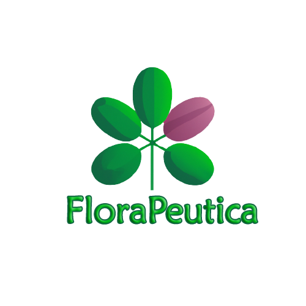

# RecetasPlantasApp . FloraPeutica
Repositorio de la Aplicación de Recetas Medicinales utilizando Plantas

## Integrantes:

1. Matias Alberto Arias Luengo
2. Felipe Ignacio Zanzana de la Vega
3. Gabriel Isaac Ruiz Manquimilla 
4. Diego Alejandro Vera Suazo

---

# Iniciativa de Proyecto 

### Monitoreo de Plantas 

 El proyecto consiste de una aplicación móvil que permitirá a los usuarios aprovechar la capacidad de la inteligencia artificial de reconocer tipos de plantas, así como también entregará consejos relacionados a la salud de las plantas, sus cuidados enfermedades y usos. La aplicación deberá permitir al usuario:
 - El uso de la cámara del dispositivo 
 - Poder crear “colecciones” para guardar plantas específicas.

 ### Escenarios a Resolver:
 La aplicación permitirá al usuario identificar las propiedades medicinales de plantas, entregando recetas para la creación de ungüentos curativos, brebajes y purificadores de ambiente.
 - Es trabajo del equipo decidir si harán el diseño de sus interfaces para móvil o escritorio. 
 - Cada equipo debe escoger el nombre representativo de su app/sitio.